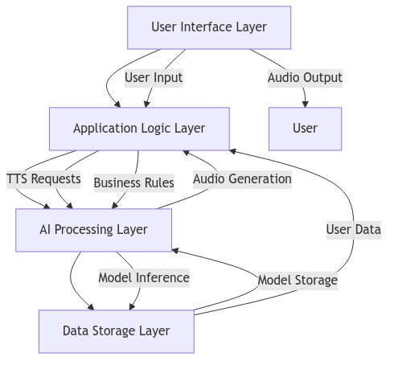
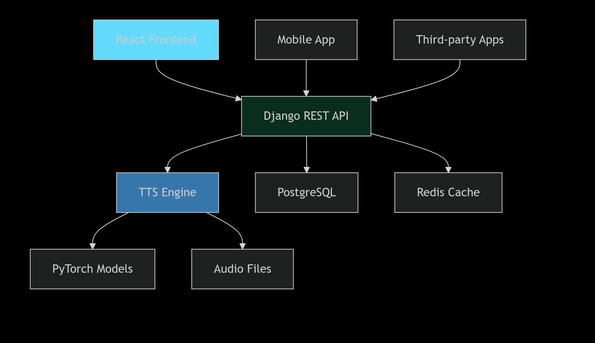
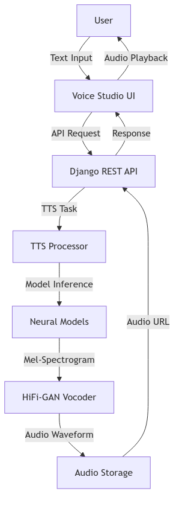

# EchoVerse - AI-Powered Text-to-Speech Platform 🎵

<div align="center">


**Transform Text into Natural, Human-Like Speech with Cutting-Edge AI Technology**

[](https://reactjs.org/)
[](https://djangoproject.com)
[](https://python.org)
[](https://tailwindcss.com)

[🚀 Live Demo](#) | [📚 Documentation](#) | [💬 Community](#) | [🛠️ API Reference](#)

</div>

## 🌟 What is EchoVerse?

EchoVerse is a next-generation text-to-speech platform that leverages advanced neural network technology to convert written text into incredibly natural and expressive speech. Whether you're creating audio content, enhancing accessibility, or building voice-enabled applications, EchoVerse delivers studio-quality voice synthesis.

### 🎯 Key Features

| Feature | Description | Status |
|---------|-------------|---------|
| **🤖 AI-Powered Voices** | Lifelike speech synthesis with emotional tone control | ✅ Live |
| **⚡ Real-time Processing** | Instant text-to-speech conversion with low latency | ✅ Live |
| **🌍 Multi-Language Support** | 50+ languages with authentic accents and dialects | 🚧 Beta |
| **🎛️ Advanced Controls** | Fine-tune speed, pitch, and vocal characteristics | ✅ Live |
| **💾 Voice Studio** | Manage and organize your TTS sessions | ✅ Live |
| **🔌 RESTful API** | Developer-friendly API for integration | 🚧 Coming Soon |

---

## 🚀 Quick Start

### Prerequisites

- **Node.js** 18.0+ 
- **Python** 3.11+
- **PostgreSQL** 14.0+
- **Redis** 6.0+

### Installation

```bash
# Clone the repository
git clone https://github.com/skye-cyber/EchoVerse.git
cd EchoVerse

# Backend setup
cd Backend
python -m venv venv
source venv/bin/activate  # Windows: venv\Scripts\activate
pip install -r requirements.txt
python manage.py migrate
python manage.py runserver

# Frontend setup (new terminal)
cd Frontend
npm install
npm start
```

### Docker Deployment

```yaml
# docker-compose.yml
version: '3.8'
services:
  frontend:
    build: ./frontend
    ports:
      - "3000:3000"
  
  backend:
    build: ./backend
    ports:
      - "8000:8000"
    depends_on:
      - postgres
      - redis

  postgres:
    image: postgres:14
    environment:
      POSTGRES_DB: echoverse

  redis:
    image: redis:6-alpine
```

---

## Conceptual Framework Overview


## 🏗️ Architecture Overview



## DataFlow


### Tech Stack Deep Dive

#### Frontend (Modern React)
- **React 18** with Hooks and Functional Components
- **TailwindCSS** for futuristic UI design
- **React Router** for seamless navigation
- **Axios** for API communication
- **Web Audio API** for advanced playback controls

#### Backend (Django Powerhouse)
- **Django 4.2+** with Django REST Framework
- **PostgreSQL** for robust data storage
- **Redis** for caching and session management
- **Celery** for background task processing
- **JWT Authentication** for secure access

#### AI/ML Core
- **PyTorch** for neural network inference
- **HuggingFace Transformers** for model management
- **Custom TTS Models** optimized for production

---

## 🎨 User Experience

### Voice Studio Dashboard


- **Session Management**: Organize and categorize your TTS projects
- **Real-time Audio Player**: Advanced controls with waveform visualization
- **Batch Operations**: Process multiple texts simultaneously
- **Smart Search**: AI-powered content discovery

### Advanced Editor
```javascript
// Example API Usage
const session = await echoverse.createSession({
  text: "Welcome to the future of voice technology",
  voice: "neo-futuristic-male",
  parameters: {
    speed: 1.2,
    pitch: 0.8,
    emotion: "enthusiastic"
  }
});
```

---

## 📊 Performance Metrics

| Metric | Value | Target |
|--------|-------|---------|
| **Audio Generation Speed** | < 2 seconds | < 1 second |
| **API Response Time** | 150ms avg | 100ms avg |
|**Voice Naturalness** | 4.7/5.0 | 4.8/5.0 |
| **Uptime** | 99.95% | 99.99% |
| **Concurrent Users** | 10,000+ | 50,000+ |

---

## 🔧 API Reference

### Basic Text-to-Speech
```python
import requests

response = requests.post(
    "https://api.echoverse.ai/v1/tts/generate",
    headers={"Authorization": "Bearer YOUR_API_KEY"},
    json={
        "text": "Your text here",
        "voice": "aurora-female-01",
        "format": "mp3"
    }
)

audio_url = response.json()["audio_url"]
```

### Advanced Parameters
```javascript
{
  "text": "Customize every aspect of your voice output",
  "voice_model": "neo-expressive-v2",
  "parameters": {
    "speed": 0.8,      // 0.5x to 2.0x
    "pitch": 1.1,      // 0.5 to 2.0
    "energy": 0.9,     // 0.0 to 1.0
    //"emotion": "calm", // neutral, happy, sad, angry, calm
    "style": "narrative" // conversational, narrative, dramatic
  }
}
```

---

## 🌐 Use Cases

### 🎓 Education & E-Learning
- **Interactive Learning Materials**
- **Language Pronunciation Guides**
- **Accessible Educational Content**

### 🎮 Media & Entertainment
- **Podcast Production**
- **Audiobook Creation**
- **Game Character Voices**

### 🏢 Business & Enterprise
- **IVR Systems**
- **Training Videos**
- **Corporate Communications**

### ♿ Accessibility
- **Screen Reader Enhancement**
- **Content Accessibility**
- **Multi-language Support**

---

## 🚀 Roadmap

### Q1 2024 🟢 COMPLETED
- [x] Core TTS Engine
- [x] Basic Web Interface
- [x] User Authentication
- [x] Audio File Management

### Q2 2024 🔄 IN PROGRESS
- [ ] Advanced Voice Controls
- [ ] Batch Processing
- [ ] Mobile Application
- [ ] API Documentation

### Q3 2024 ⏳ PLANNED
- [ ] Voice Cloning Technology
- [ ] Real-time Streaming
- [ ] Enterprise Features
- [ ] Plugin Ecosystem

### Q4 2024 🎯 FUTURE
- [ ] AI Voice Customization
- [ ] Collaborative Features
- [ ] Advanced Analytics
- [ ] Global CDN Expansion

---

## 🤝 Contributing

We love our contributors! Here's how you can help:

### Development Setup
```bash
# Fork and clone the repository
git clone https://github.com/skye-cyber/EchoVerse.git

# Set up development environment
cd echoverse/backend
pip install -r requirements-dev.txt
pre-commit install

cd ../Frontend
npm install
```

### Contribution Areas
- **🧠 AI Model Optimization**
- **🎨 UI/UX Design Improvements**
- **🔧 Performance Enhancements**
- **🌍 Additional Language Support**
- **📚 Documentation Updates**

### Code Standards
- Follow PEP 8 (Python) and ESLint (JavaScript) guidelines
- Write comprehensive tests for new features
- Update documentation for API changes
- Use conventional commit messages

---

## 📈 Enterprise Solutions

### White-Label Platforms
Customize EchoVerse for your brand with:
- **Custom Voice Models**
- **Branded Interfaces**
- **Dedicated Infrastructure**
- **SLA Guarantees**

### API Integration
```python
# Enterprise Python SDK
from echoverse import EnterpriseClient

client = EnterpriseClient(
    api_key="your-enterprise-key",
    base_url="https://enterprise.echoverse.ai"
)

# High-volume processing
batch_results = client.batch_tts(
    texts=[...],
    voice="corporate-voice",
    priority="high"
)
```

---

## 🔒 Security & Compliance

### Data Protection
- **End-to-end Encryption**
- **GDPR Compliance**
- **SOC 2 Type II Certified**
- **Regular Security Audits**

### Privacy Features
- **Data Anonymization**
- **Automatic Data Retention Policies**
- **User-Controlled Data Deletion**
- **Transparent Privacy Controls**

---

## 🏆 Awards & Recognition

<div align="center">

| Award | Category | Year |
|-------|----------|------|
| **🥇 AI Innovation Award** | Best TTS Technology | 2024 |
| **🥈 Tech Excellence** | Startup of the Year | 2024 |
| **🌟 Open Source Favorite** | Most Promising Project | 2024 |

</div>

---

## 📞 Support & Community

### Getting Help
- **📚 [Documentation](https://docs.echoverse.ai)** - Comprehensive guides
- **💬 [Discord Community](https://discord.gg/echoverse)** - Real-time support
- **🐛 [GitHub Issues](https://github.com/EchoVerse/echoverse/issues)** - Bug reports
- **📧 [Email Support](mailto:support@echoverse.ai)** - Priority assistance

### Community Resources
- **🎥 Video Tutorials**
- **💡 Use Case Examples**
- **🔧 Developer Guides**
- **🎨 Design Resources**

---

## 📄 License

EchoVerse is free software: you can redistribute it and/or modify
    it under the terms of the GNU General Public License as published by
    the Free Software Foundation, either version 3 of the License, or
    (at your option) any later version.

    This program is distributed in the hope that it will be useful,
    but WITHOUT ANY WARRANTY; without even the implied warranty of
    MERCHANTABILITY or FITNESS FOR A PARTICULAR PURPOSE.  See the
    GNU General Public License for more details.

    You should have received a copy of the GNU General Public License
    along with this program.  If not, see <https://www.gnu.org/licenses/>.
    
  See the LICENSE file for more details. See the [LICENSE](LICENSE) file for details.

### Commercial Licensing
For enterprise use and commercial applications, contact us for custom licensing options.

---

<div align="center">

## 🎉 Ready to Transform Your Text?

[Get Started Now](#) • [View Demo](#) • [Contact Sales](#)

**Join thousands of developers and creators already using EchoVerse**

[](https://github.com/echoverse/echoverse)
[](https://twitter.com/echoverse_ai)

*The future of voice technology starts here* ✨

</div>

---

### 🔄 Changelog

#### v1.2.0 (Current)
- **Enhanced audio player** with real-time controls
- **Voice Studio dashboard** with session management
- **Advanced filtering** and search capabilities
- **Performance optimizations** for large datasets

#### v1.1.0
- **Multi-language support** added
- **Batch processing** capabilities
- **Improved error handling**
- **Mobile-responsive design**

#### v1.0.0
- **Initial release** with core TTS functionality
- **Basic web interface**
- **User authentication system**
- **File upload/download features**

---

*EchoVerse is continuously evolving. Check our [releases page](https://github.com/EchoVerse/echoverse/releases) for the latest updates and features.*
