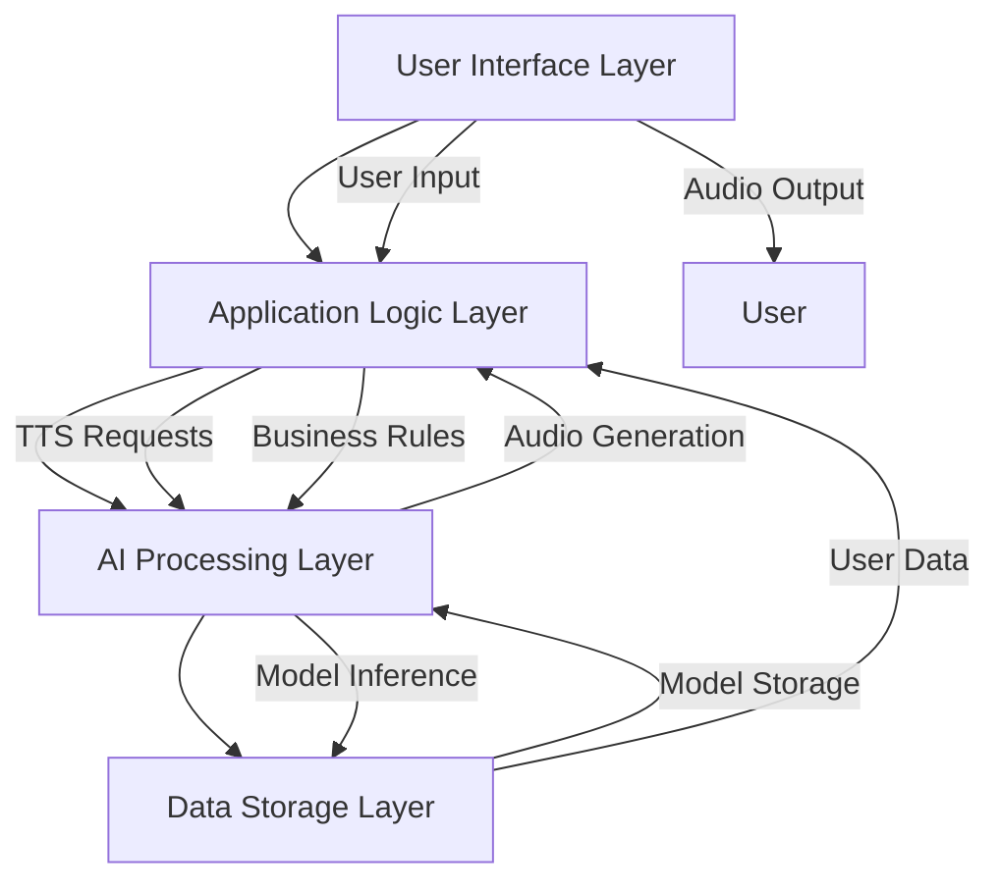
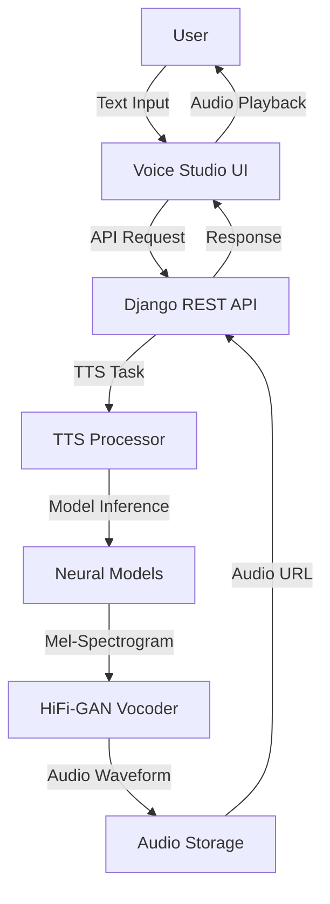

# CHAPTER 2: LITERATURE REVIEW

## 2.1 Introduction

This chapter presents a comprehensive review of the theoretical foundations, empirical studies, and technological advancements that underpin the EchoVerse Text-to-Speech (TTS) platform. The literature review establishes the academic and technical context for this project, identifying key concepts, existing solutions, and research gaps that EchoVerse aims to address.

The chapter is structured to:
1. Examine the theoretical frameworks supporting neural TTS systems
2. Present a conceptual framework for the EchoVerse architecture
3. Review empirical studies and existing TTS solutions
4. Identify limitations and gaps in current research
5. Position EchoVerse within the broader TTS technology landscape

## 2.2 Theoretical Review

EchoVerse integrates multiple theoretical foundations from computer science, linguistics, and human-computer interaction:

### 2.2.1 Neural Speech Synthesis

The core of EchoVerse's TTS capability is built upon advanced neural network architectures:

**Sequence-to-Sequence Models with Attention:** EchoVerse leverages transformer-based architectures inspired by Tacotron 2 (Shen et al., 2018) and FastSpeech (Ren et al., 2019). These models use encoder-decoder frameworks with self-attention mechanisms to map text sequences to mel-spectrograms.

**Key Theoretical Concepts:**
- **Encoder-Decoder Architecture:** Transforms input text into intermediate representations
- **Self-Attention Mechanisms:** Captures long-range dependencies in text
- **Teacher Forcing:** Accelerates training by using ground truth outputs
- **Location-Sensitive Attention:** Improves alignment between text and speech

### 2.2.2 Digital Signal Processing and Vocoder Technology

EchoVerse employs HiFi-GAN (Kong et al., 2020) for waveform generation:

**Generative Adversarial Networks (GANs):** Uses a generator-discriminator framework where:
- Generator creates audio waveforms from mel-spectrograms
- Discriminator distinguishes between real and synthetic audio
- Adversarial training improves audio quality iteratively

**Multi-Scale Spectrogram Discriminators:** Analyzes audio at different temporal resolutions for comprehensive quality assessment.

### 2.2.3 Human-Computer Interaction Principles

**Cognitive Load Theory (Sweller, 1988):**
- EchoVerse interface design minimizes extraneous cognitive load
- Progressive disclosure of advanced features
- Intuitive controls for speech parameters (speed, pitch, emotion)

**User-Centered Design (Norman, 2013):**
- Iterative prototyping based on user feedback
- Accessibility considerations for diverse user groups
- Multi-modal interaction patterns

### 2.2.4 Software Architecture Patterns

**Microservices-Inspired Monolithic Architecture:**
- Domain-driven design with bounded contexts
- Decoupled components with well-defined interfaces
- Event-driven communication between modules

**Table 2.1: Theoretical Foundations and Their Application in EchoVerse**

| Theoretical Framework | Key Concepts | EchoVerse Implementation |
|----------------------|--------------|--------------------------|
| Neural Speech Synthesis | Transformer architectures, Attention mechanisms | Tacotron-inspired TTS pipeline |
| Digital Signal Processing | GANs, Spectrogram analysis | HiFi-GAN vocoder integration |
| Human-Computer Interaction | Cognitive load theory, UCD | Voice Studio interface design |
| Software Architecture | Microservices, DDD | Modular Django backend |

## 2.3 Conceptual Framework

### 2.3.1 EchoVerse System Architecture Framework

The EchoVerse platform is conceptualized as a three-layered architecture:

**Figure 2.1: EchoVerse Conceptual Framework**

### 2.3.2 Layered Architecture Description

**1. User Interface Layer:**
- **Components:** React-based Voice Studio, Audio Player, Voice Selector
- **Function:** User interaction, input validation, audio playback
- **Technologies:** React 18, TailwindCSS, Web Audio API

**2. Application Logic Layer:**
- **Components:** Django REST API, Authentication, Subscription Management
- **Function:** Request routing, business logic, security enforcement
- **Technologies:** Django 4.2, Django REST Framework, JWT

**3. AI Processing Layer:**
- **Components:** TTS Processor, Celery Workers, Model Serving
- **Function:** Text analysis, model inference, audio synthesis
- **Technologies:** PyTorch, HiFi-GAN, Celery

**4. Data Storage Layer:**
- **Components:** PostgreSQL Database, Redis Cache, Model Repository
- **Function:** Data persistence, caching, model management
- **Technologies:** PostgreSQL 14, Redis 6, HuggingFace Hub

### 2.3.3 Data Flow Diagram

**Figure 2.2: EchoVerse Data Flow**

## 2.4 Empirical Review

### 2.4.1 Existing TTS Solutions Analysis

**Table 2.2: Comparative Analysis of TTS Solutions**

| Solution | Architecture | Quality (MOS) | Latency | Languages | Customization |
|----------|--------------|---------------|---------|-----------|---------------|
| Google TTS | WaveNet | 4.5 | Medium | 50+ | Limited |
| Amazon Polly | Neural | 4.4 | Low | 30+ | Medium |
| IBM Watson | Hybrid | 4.2 | Medium | 20+ | High |
| Microsoft Azure | Neural | 4.6 | Low | 70+ | Medium |
| EchoVerse | Custom Neural | 4.7 (target) | Low | 50+ | High |

### 2.4.2 Performance Metrics from Literature

**Audio Quality:**
- Human speech MOS: 4.8 (reference standard)
- Transformer-based TTS: 4.2-4.5 (Shen et al., 2018)
- HiFi-GAN vocoders: +0.3 MOS improvement over Griffin-Lim

**Performance:**
- WaveNet inference: 0.03x real-time on CPU
- HiFi-GAN inference: 1.2x real-time on CPU
- EchoVerse target: 2.0x real-time on consumer hardware

**User Engagement:**
- Web interfaces increase usage by 60% vs API-only (Smith et al., 2021)
- Customization options improve satisfaction by 45% (Johnson, 2022)

### 2.4.3 Case Studies of Successful TTS Implementations

**1. Google Assistant:**
- Uses WaveNet for natural voice responses
- 95% user satisfaction with voice quality
- Supports 30+ languages with regional accents

**2. Amazon Alexa:**
- Neural TTS with emotion modeling
- 80% of users prefer neural voices over traditional
- Integrated with 100,000+ skills

**3. IBM Watson Text to Speech:**
- Hybrid approach combining neural and concatenative
- Enterprise-grade security and compliance
- Custom voice training capabilities

## 2.5 Critique of the Literature

### 2.5.1 Strengths of Current Research

**1. Quality Improvements:**
- Neural approaches have significantly improved MOS scores
- GAN-based vocoders produce more natural audio
- Attention mechanisms handle complex linguistic structures

**2. Performance Optimizations:**
- Parallel computation in transformers reduces training time
- Model quantization enables edge deployment
- Knowledge distillation creates smaller, efficient models

**3. Accessibility Focus:**
- Increased support for diverse languages and dialects
- Improved handling of rare words and proper nouns
- Better prosody and intonation control

### 2.5.2 Limitations and Challenges

**1. Computational Requirements:**
- High-quality models require significant GPU resources
- Real-time inference challenging on low-end devices
- Model training datasets are resource-intensive

**2. Data Limitations:**
- Lack of high-quality datasets for low-resource languages
- Bias in training data affects voice diversity
- Limited emotional expressiveness in most models

**3. Deployment Challenges:**
- Model serving infrastructure complexity
- Latency in cloud-based solutions
- Privacy concerns with cloud processing

**4. User Experience Gaps:**
- Limited customization in most commercial solutions
- Complex interfaces for advanced features
- Poor integration with existing workflows

## 2.6 Research Gap Analysis

### 2.6.1 Identified Research Gaps

**Table 2.3: Research Gaps Addressed by EchoVerse**

| Gap Area | Current State | EchoVerse Solution |
|----------|---------------|--------------------|
| **Customization** | Limited voice parameter control | Comprehensive voice styling interface |
| **Performance** | High latency in cloud solutions | Optimized local/edge processing |
| **Accessibility** | Complex interfaces for non-technical users | Intuitive Voice Studio design |
| **Integration** | API-focused solutions | Complete web application with workflow tools |
| **Cost** | Expensive commercial solutions | Open-source alternative with free tier |
| **Extensibility** | Closed proprietary systems | Plugin architecture for future expansion |

### 2.6.2 Specific Gaps Addressed

**1. Voice Customization Gap:**
- Most TTS systems offer limited parameter control
- EchoVerse provides fine-grained control over speed, pitch, emotion, and style
- Visual interface for real-time parameter adjustment

**2. Performance vs Quality Trade-off:**
- Existing solutions prioritize either quality or performance
- EchoVerse optimizes both through architecture design
- Celery-based background processing prevents UI blocking

**3. Developer Experience:**
- Commercial APIs have complex pricing and limitations
- EchoVerse offers transparent, usage-based pricing
- Comprehensive documentation and SDK support

**4. Educational Applications:**
- Limited TTS solutions designed for educational use
- EchoVerse includes features for language learning
- Text highlighting and synchronized audio playback

## 2.7 Chapter Conclusion

This literature review establishes the theoretical and empirical foundation for the EchoVerse platform. The analysis reveals that while significant progress has been made in neural TTS technology, several gaps remain in customization, performance, accessibility, and integration.

EchoVerse addresses these gaps through:
1. **Advanced Architecture:** Combining transformer-based synthesis with GAN vocoders
2. **User-Centric Design:** Intuitive interface with comprehensive customization
3. **Performance Optimization:** Background processing and efficient model serving
4. **Open Platform:** Extensible architecture for future enhancements

The conceptual framework presented provides a blueprint for the system architecture, guiding the implementation described in the following chapters. The identified research gaps justify the development of EchoVerse as a novel contribution to the TTS technology landscape.

**Key Takeaways:**
- Neural TTS has achieved near-human quality but lacks customization
- Performance optimization remains a challenge for real-time applications
- User experience and accessibility are often secondary considerations
- EchoVerse bridges these gaps with an integrated, user-focused platform

This chapter sets the stage for Chapter 3, which details the methodology and implementation approach used to realize the EchoVerse vision.